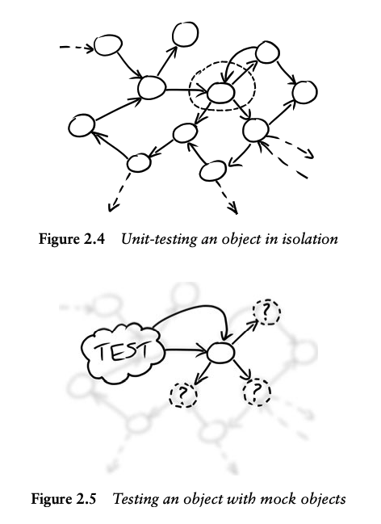
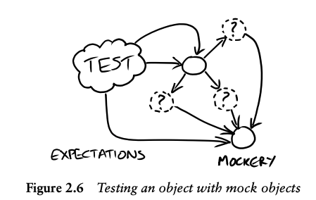

# 

## A Web of Objects

オブジェクト指向設計は、オブジェクトそのものよりも**オブジェクト間のコミュニケーション**に重きを置きます。Alan Kay [Kay98] は次のように書いています。

> The big idea is “messaging” […] The key in making great and growable systems is
> much more to design how its modules communicate rather than what their internal
> properties and behaviors should be.

オブジェクトは**メッセージ**によってコミュニケーションします。他のオブジェクトからメッセージを受け取り、他のオブジェクトへメッセージを送ることで反応し、ときには元の送信者に値や例外を返します。オブジェクトは、自分が理解する各種メッセージを処理する**メソッド**を持ち、たいていの場合は、他オブジェクトとの通信を調整するための**内部状態**をカプセル化します。

オブジェクト指向システムは、**協調するオブジェクトの網（web）**です。システムは、オブジェクトを作成し、互いにメッセージを送れるように**接続（プラグイン）**して構築します。システムのふるまいは、オブジェクトの**合成（コンポジション）**――どのオブジェクトを選び、どう接続するか――の結果として**創発的**に現れます（Figure 2.1）。

これにより、手続き型コードを書くのではなく、**オブジェクトの構成**を変えることでシステムのふるまいを変更できます。すなわち、インスタンスの追加・削除や、別の組み合わせでの接続です。私たちがこの構成を管理するために書くコードは、「オブジェクトの網」が**どのように振る舞うかの宣言的な定義**になります。**何をさせたいか**に集中でき、**どのように**実現するかの詳細からは切り離して、より容易にシステムのふるまいを変更できます。

---

## メッセージに従う

この高レベルで宣言的なアプローチの恩恵を受けるには、オブジェクトが容易にプラグインできるよう設計されている必要があります。実務的には、共通の**コミュニケーションパターン**に従い、オブジェクト間の**依存関係が明示的**であることを意味します。コミュニケーションパターンとは、複数のオブジェクトがどのように会話するかを規定する一連のルール――それぞれの**役割**、どんな**メッセージ**をいつ送れるか、など――のことです。Java のような言語では、（具象）クラスではなく（**抽象**）**インターフェース**でオブジェクトの役割を表現します――もっとも、インターフェースだけでは必要なことをすべて表せるわけではありません。

私たちの見解では、**ドメインモデル**はこれらのコミュニケーションパターンの中にあります。なぜなら、それこそがオブジェクト間に起こりうる関係の宇宙に**意味**を与えるからです。システムを、その**動的なコミュニケーション構造**という観点で捉えるのは、多くの人がオブジェクト入門で学ぶ**静的分類**からの大きな意識転換です。しかも、私たちが日常的に使うプログラミング言語では、このコミュニケーションパターンが明示的には表現されないため、**ドメインモデルは一見すると目に見えません**。本書では、テストと**モックオブジェクト**がオブジェクト間のコミュニケーションをより明瞭に捉える助けになることを示したいと思います。

以下は、オブジェクト間のコミュニケーションに焦点を当てると設計がどのように導かれるかを示す小さな例です。

ビデオゲームでは、ゲーム中のオブジェクトには次のようなものがあります。プレイヤーや敵といった**アクター**、プレイヤーが飛び越えていく**背景（scenery）**、プレイヤーが衝突し得る**障害物（obstacles）**、そして**爆発や煙**などのエフェクト。さらに、ゲームの進行に伴って舞台裏でオブジェクトを生成する**スクリプト**も存在します。

これは、**プレイヤーの視点**から見たゲームオブジェクトの良い分類です。ゲームをプレイする際――外部からゲームと相互作用する際――に必要な判断を支えるからです。しかし、**実装者**にとって有用な分類とは言えません。ゲームエンジンは、**表示可能なオブジェクト**を描画し、**アニメーションするオブジェクト**に時間の経過を通知し、**物理的オブジェクト**同士の衝突を検出し、物理的オブジェクトが衝突したときに**何をすべきかの判断**を**衝突解決器（collision resolver）**に委譲しなければなりません。

たとえば **Obstacle** は **Visible** かつ **Physical** ですが、**Script** は **Collision Resolver** であり **Animated** ではあるものの **Visible** ではありません。ゲーム内のオブジェクトは、エンジンがその時点で何を必要としているかに応じて、異なる**役割**を担います。この**静的な分類**と**動的なコミュニケーション**のミスマッチにより、ゲームオブジェクトに整然とした**クラス階層**を与えつつ、同時にエンジンの要求にも適合させることは難しくなります。

せいぜい、クラス階層はアプリケーションの**1つの次元**を表し、オブジェクト間で実装の詳細を共有するための仕組みを提供するにとどまります。たとえば、フレームベースのアニメーションの共通機能を実装する**基底クラス**を用意する、といった形です。最悪の場合、私たち自身のものを含め、**1つのメカニズムで複数の概念を表現しようとして**複雑さと重複に苦しむコードベースをあまりにも多く目にしてきました。

> 役割・責務・コラボレータ

>> 私たちは、オブジェクトを**役割（roles）・責務（responsibilities）・コラボレータ（collaborators）**の観点で考えるようにしています。これは [Wirfs-Brock03]（Wirfs-Brock と McKean）で最もよく説明されています。オブジェクトは 1 つ以上の**役割**の実装であり、**役割**は関連する**責務**の集合です。**責務**とは、タスクを実行する義務、または情報を知っている義務のことです。**コラボレーション**とは、オブジェクト同士、役割同士、またはその両方の相互作用を指します。

>> ときにはキーボードから離れて、Wirfs-Brock と McKean が紹介する**CRC カード**（Candidates, Responsibilities, Collaborators）という非形式の設計手法を使います。アイデアは、**ローテクな索引カード**を使って、アプリケーション（またはその一部）の潜在的なオブジェクト構造を探ることにあります。これらのカードを用いることで、細部に囚われたり、初期の解に過度に固執したりすることなく、**構造を試行**できます。

---

## Tell, Don’t Ask（尋ねずに命じる）
私たちはオブジェクト同士がメッセージを送り合うよう設計しますが、では何を伝えるべきでしょうか。私たちの経験では、呼び出し側のオブジェクトは、隣接オブジェクトが果たす**役割**の観点から「自分が望むこと」を**述べ**、それを**どう実現するか**は呼び出される側に委ねるべきです。これは一般に **“Tell, Don’t Ask”** スタイル、より形式的には**デメテルの法則（Law of Demeter）**として知られています。オブジェクトは、**内部に保持する情報**と**トリガーとなったメッセージに付随する情報**のみに基づいて意思決定し、処理を進めるために他のオブジェクトへ**たどっていくこと（ナビゲーション）を避けます**。このスタイルを一貫して適用すると、同じ役割を担うオブジェクトの差し替えが容易になり、**柔軟なコード**になります。呼び出し側は、役割インターフェースの背後にある内部構造や、システム他部の構造を一切意識しません。

このスタイルに従わないと、いわゆる「**列車事故（train wreck）**」コードに陥ることがあります。getter を**連結**して列車の車両のように長くつなげてしまう形です。インターネットで見かけた一例を示します。

```
((EditSaveCustomizer) master.getModelisable()
 .getDockablePanel()
 .getCustomizer())
 .getSaveItem().setEnabled(Boolean.FALSE.booleanValue());
```

少し考えて、私たちはこの断片が本来伝えたかったことを次のように言い換えられると気づきました。

```
master.allowSavingOfCustomisations();
```

このひと呼び出しの背後に、すべての実装詳細を**包み込み**ます。`master` のクライアントは、連鎖の途中にある型について何も知る必要がなくなりました。これにより、設計変更の波及がコードベースの**遠く離れた箇所**へ伝播するリスクを減らせます。

情報を隠蔽できることに加えて、**“Tell, Don’t Ask”** にはより微妙な利点があります。getter の連鎖に暗黙に埋もれがちな**オブジェクト間の相互作用**を、**明示的に表し、名前を与える**ことを強制してくれる点です。上の短い版は、**どのように**実装されているかではなく、**何のため**の呼び出しなのかをはるかに明確に示しています。

---
## But Sometimes Ask
もちろん、何でもかんでも「tell（命じる）」わけではありません【訳注：Tell, Don’t Ask の対比】。**値（values）**や**コレクション**から情報を取得するとき、あるいは**ファクトリ**で新しいオブジェクトを生成するときは「ask（尋ねる）」を行います。ときには、検索やフィルタリングのためにオブジェクトの状態を問い合わせることもありますが、その際も表現力を保ち、「列車事故（train wreck）」を避けたいところです。

たとえば（比喩を続けると）、指定席を列車全体に分散させたいという素朴な実装として、次のように書き始めてしまうかもしれません。

```java
public class Train {
 private final List<Carriage> carriages […]
 private int percentReservedBarrier = 70;
 public void reserveSeats(ReservationRequest request) {
 for (Carriage carriage : carriages) {
 if (carriage.getSeats().getPercentReserved() < percentReservedBarrier) {
 request.reserveSeatsIn(carriage);
 return;
 }
 }
 request.cannotFindSeats();
 }
}
```

このために `Carriage` の内部構造をさらすべきではありません。列車内には異なる種類の客車が混在しているかもしれないからです。代わりに、**本当に知りたいことそのもの**をオブジェクトに尋ね、判断に必要な細部情報を引き出して自分で解決しようとしないほうが良いでしょう。

```java
public void reserveSeats(ReservationRequest request) {
 for (Carriage carriage : carriages) {
 if (carriage.hasSeatsAvailableWithin(percentReservedBarrier)) {
 request.reserveSeatsIn(carriage);
 return;
 }
 }
 request.cannotFindSeats();
}
```

このように**問い合わせメソッド（query method）**を追加すると、ふるまいが最も適切なオブジェクトへ移り、説明的な名前が与えられ、テストもしやすくなります。

私たちは（値ではなく）**オブジェクトへの問い合わせ**は控えめにするよう心がけます。というのも、問い合わせはオブジェクトから情報が「漏れ出す」ことを許し、システムをやや堅くしてしまいがちだからです。最低限、問い合わせは**呼び出し側の意図**を表すように書き、単なる実装詳細の露出にしないことを意識します。

---

## 協調するオブジェクトのユニットテスト

私たちは自縄自縛に陥っているように見えます。互いにコマンド（命令）を送り合い、状態を問い合わせる手段を外部に公開しない**焦点化されたオブジェクト**を求めているのですから、ユニットテストで**アサートできるものが何もない**ように思えるからです。たとえば、Figure 2.4 では、丸で囲んだオブジェクトは呼び出されると隣接する 3 つのうち 1 つ以上へメッセージを送ります。内部状態を公開せずに、それが正しくメッセージを送っていることを**どうテストすればよい**でしょうか。

1 つの選択肢は、テスト中だけ**対象オブジェクトの近傍**を**代替物（サブスティテュート）、すなわちモックオブジェクト**に置き換えることです（Figure 2.5）。トリガーとなるイベントに対して、対象オブジェクトが**モックの隣人たち**と**どのように通信すべきか**を**期待（expectation）**として指定します。テストの実行中、モックオブジェクトは**期待どおり呼び出されたか**を自らアサートします。同時に、テストを成立させるために必要な**スタブ動作**も実装します。



この基盤が整うと、TDD の進め方を変えられます。Figure 2.5 は、あたかも**対象オブジェクトだけ**をテストしており、**隣人の姿**は既に分かっていることを示唆します。しかし実際には、これらの**コラボレータ**はユニットテストを書いている**時点では存在している必要はありません**。テストを使って、対象オブジェクトに必要な**支援的な役割**を**Java のインターフェース**としてあぶり出し（定義し）、システムの他部分を開発しながら**実装を埋めていく**ことができます。私たちはこれを**インターフェース発見（interface discovery）**と呼びます。Chapter 12 では、`AuctionEventListener` を抽出する例で目にするでしょう。

---

## モックオブジェクトによる TDD 支援

このスタイルのテスト駆動プログラミングを支えるには、隣接オブジェクトの**モック**インスタンスを作成し、**どのように呼び出されるはずか**という**期待（expectation）**を定義して検証し、テストを通すために必要な**スタブ**の振る舞いを実装する必要があります。実際には、モックオブジェクトを用いたテストの**実行時構造**は――




私たちは、テストの文脈を保持し、モックの生成、期待とスタブの管理を行うオブジェクトを **mockery2** と呼びます。Part III で実践を通して示しますので、ここでは基本だけに触れます。テストの本質的な構成は次のとおりです。

* 必要なモックオブジェクトを作成する。
* 対象オブジェクトを含む実オブジェクトを作成する。
* 対象オブジェクトがモックを**どう呼ぶはずか**を指定する（期待を定義する）。
* 対象オブジェクトの**トリガーメソッド**を呼び出す。
* 得られた値が妥当であること、ならびに**期待した呼び出しがすべて行われた**ことをアサートする。

ユニットテストは、対象オブジェクトとその**環境**との関係を明示します。クラスター内のすべてのオブジェクトを生成し、対象オブジェクトとその**コラボレータ**の相互作用についてアサートします。こうしたインフラは手書きでコーディングしてもよいですし、近年は多くの言語で利用可能な**モックオブジェクト・フレームワーク**を使うこともできます。本書を通じて繰り返し強調する重要点は、**各テストの意図を明確にすること**です。すなわち、**テスト対象の機能**、それを支える**インフラ**、そして**オブジェクト構造**を区別して示すことです。

---

